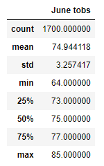
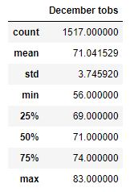

# surfs_up

## Overview of the Analysis
The purpose of this analysis is to evaluate the temperatures from the months of June and December in Hawaii. The temperature data from Hawaii is located in a SQLite file, and this analysis uses python with SQLalchemy, pandas, and datetime imported in order to access and evaluate the data. The analysis is found in this file: [SurfsUp_Challenge](SurfsUp_Challenge.ipynb)

## Results
Based on this analysis the following observations were made:

* The mean temperature for June is 74.9 Deg with a min of 64 and max of 85

    
* The mean temperature for December is 71.0 Deg with a min of 56 and a max of 83

    
* December has a slightly larger temperature spread than June with more temperatures on the low range than June

## Summary
Based on this data the weather is fairly consistant in Hawaii with slightly cooler temperatures in December. In addition to the temperature data, an additional query to run would be the precipitation data for each of the months with descriptive statistics. Running a query with the temperatures and precipitation grouped by year would show if the temperatures and precipitation have changed significantly year over year for each of the months.
